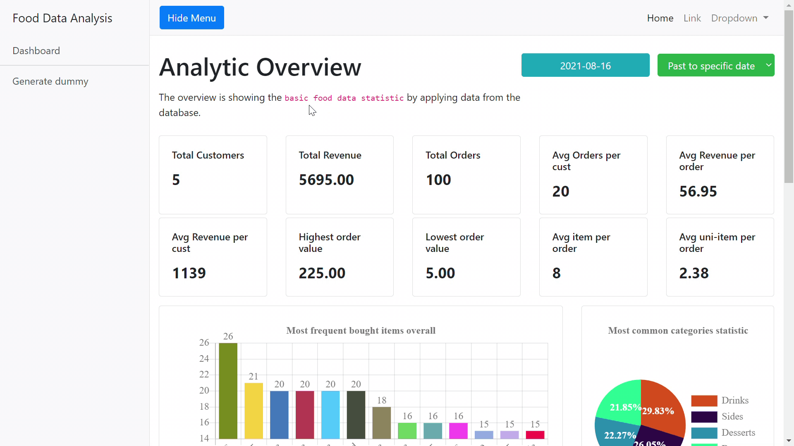

# food-analysis
This project basically was used to analyse statistic of food.
 This project is applying MVC pattern.
 ChartJS is a framework that shows chars in the project.
 <code>It has to be added DBh.php</code> 

It can manually decide how many customer and products for dummy data

Display charts such as pie, line and bar in the project with Ajax technique.

